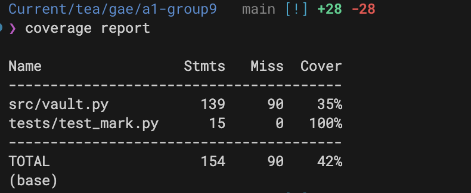
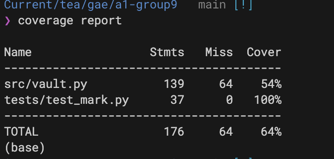

# Report for Assignment 1

## Project

Description: A secure password manager

Programming language: Python

## Initial tests

### Tests

```
import os
import pytest
from unittest.mock import patch, mock_open, MagicMock, call
import json
import base64
import sys

from src import vault

# arek
def test_store_roundtrip(tmp_path):
    test_passwords = {"test_service": {"username": "test_user", "password": "test_pass"}}
    master_password = "master123"
    file_path = str(tmp_path / "test_vault.json")
    
    with patch('os.urandom', return_value=b'fixed_salt_12345'):
        mock_file = mock_open()
        with patch('builtins.open', mock_file), \
             patch('os.rename') as mock_rename:
            vault.save_store(file_path, test_passwords, master_password)
            
            written = "".join(call.args[0] for call in mock_file().write.call_args_list)
            file_content = json.loads(written)
            assert "salt" in file_content
            assert "encrypted_data" in file_content
            
            mock_rename.assert_called_with(file_path + ".tmp", file_path)

# mark
def test_load_store_success(tmp_path):
    file_path = tmp_path / "vault.json"
    original_passwords = {"service1": {"username": "user1", "password": "password1"}}
    master_password = "correct_password"

    vault.save_store(str(file_path), original_passwords, master_password)

    with patch("getpass.getpass", return_value=master_password), patch(
        "builtins.print"
    ):
        loaded_passwords, loaded_master_pw = vault.load_store(str(file_path))

    assert loaded_passwords == original_passwords
    assert loaded_master_pw == master_password

```

### Coverage of initial tests

TODO: Inform the name of the existing tool that was executed and how it was executed

TODO: Show the coverage results provided by the existing tool with a screenshot

## Coverage improvement

### Individual tests

Tijn:


  


Initial test coverage was 22%. After adding two additional tests—covering the functions `create_new_store()` and `print_help()`—coverage increased to 28%.

This increase was expected since the new tests are relatively simple helper tests. The `print_help()` test may seem redundant, but including it helps improve coverage and ensures that the printed help text is less likely to be changed accidentally.

Overall, while the coverage gain is modest, these tests contribute to the total coverage and are important for maintaining code quality.

Arek: 


Managed to achieve a 13% increase in test coverage. My original tests were test_store_roundtrip and test_save_is_atomic, then I eended up adding test_invalid_master_password and test_create_new_store


Mark:

Screenshot 1: Initial Coverage Report





Screenshot 2: Final Coverage Report




Initial test coverage for src/vault.py was 35%, established by a single baseline test. After adding three new, targeted tests, the coverage for the application source code increased significantly to 54%. This represents a total improvement of 19%.
The substantial increase in coverage is due to the strategic addition of tests that target previously uncovered execution paths, including error handling, specific logic branches, and interactive loop conditions.

### Overall

TODO: Provide a screenshot of the old coverage results by running an existing tool (the same as you already showed above)

TODO: Provide a screenshot of the new coverage results by running the existing tool using all test modifications made by the group

## Statement of individual contributions

Mark:I wrote 2 functions,3 tests and helped finish the readme.md report file.

Tijn: I wrote 3 functions in vault.py: Savestore, createnewstore, and printhelp. Created 3 tests, found in tests/tests_tijn.py. Helped with the README.md.

Arek: I wrote 3 functions in vault.py and 4 tests

Felix:

| Member | Three functions created | Initial test (name) | Other tests (names) |
| --- | --- | --- | --- |
| Member Mark | derive_key, load store | | |
| Member Arek | handle_get, handle_set, handle_list| test_store_roundtrip | test_save_is_atomic, test_invalid_master_password, test_create_new_store|
| Member Tijn | create_new_store, print_store, print_help | test_create_new_store_success | test_create_new_store_password_mismatch, test_print_help_output |
| Member D | | | |
